# Save-a-Term

Hardware for an IBM 5251 and 3278 reverse keyboard adapter to use a regular PS/2 keyboard with the original terminals. Based on my TMK controller fork (https://github.com/inmbolmie/ps2_to_4704_converter)

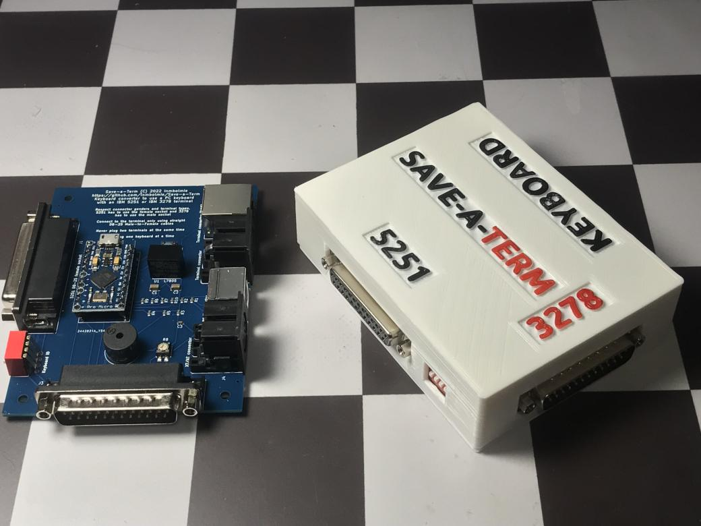

## Introduction

You got a pretty vintage 5251 or 3278 terminal but it lacks the original keyboard. The original keyboards are very expensive and sought-after items that can easily go for thousands of dollars. This adapter tries to solve that problem giving a way to use a cheap standard PS/2-like keyboard with the original terminals.

The adapter emulates the clicker functionality of the original keyboards using a buzzer to give audible feedback while typing.

The adapter will also auto-detect the terminal type (5251 or 3278) and use the correct scancode set and signal polarities for the connected terminal.

If you like it, want an adapter or PCB, or need any information not covered here you can drop me an email to the address:  inmbolmie [AT] gmail [DOT] com

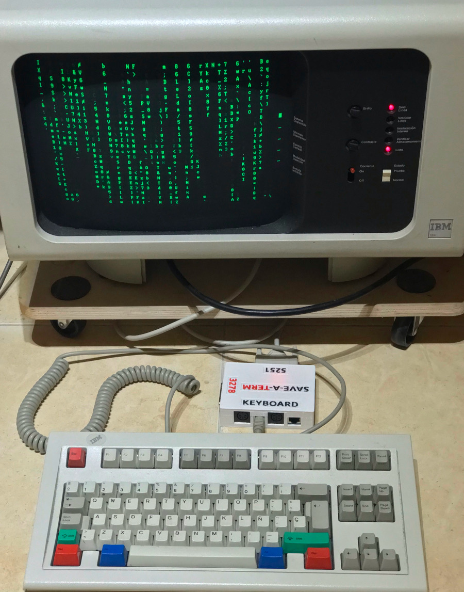

## Compatibility

This converter is only compatible with original IBM 5251 and 3278 terminals.

- The original IBM 5251 terminal keyboard has a DB25 female connector
- The original IBM 3278 terminal keyboard has a DB25 male connector

If not totally sure, check the voltages accross your terminal connector pins before plugging it to the adapter, here you have the expected 5251 and 3278 keyboard pinouts:

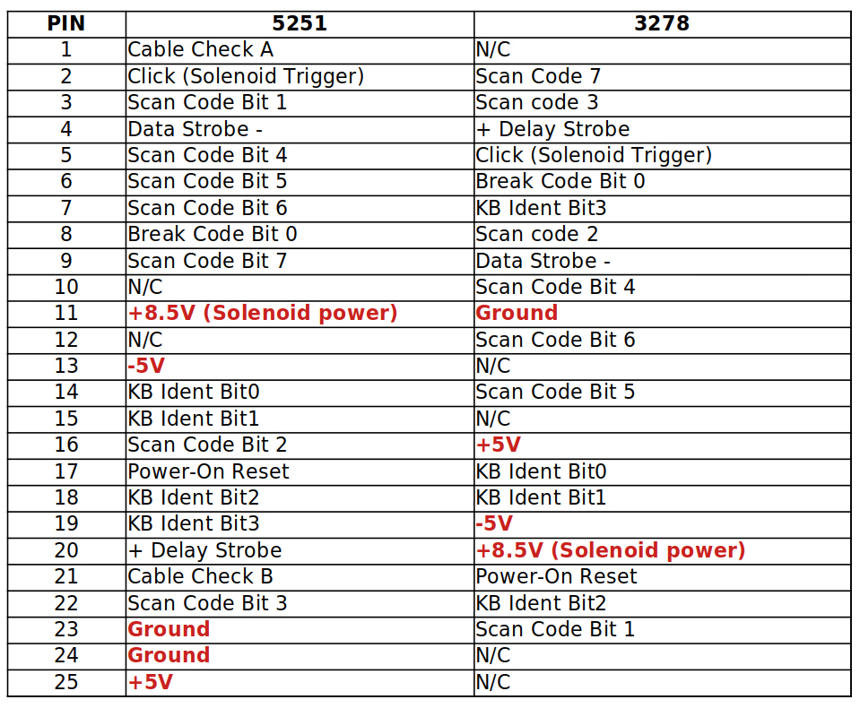

__This adapter is not compatible with other similar IBM connectors like 3277, 5291 or Displaywriter, so do not try it with those.__

This is not an adapter to plug an original 5251/3278 keyboard to a modern PC and won't ever work like that, so don't ask.

Pinouts are fully incompatible so a different connector is provided for each terminal type. Moreover, __it is dangerous to connect the terminal to the wrong connector as pretty weird voltages will be misplaced accross the connector (+8.5V, +5V, -5V) so you can fry the converter and/or terminal doing that, so be warned.__

This controller do not pretend to be universal in the sense some keyboards could be not compatible, but to provide a reasonable selection of cheap keyboards readily available. I have tested the converter using:

* Regular IBM model M
* IBM PC (XT)
* IBM AT (Model F)
* IBM terminal keyboards (M and F)
* Several PS/2 compatible keyboards

As said, it is not guaranteed that a particular keyboard will work, but there is a more than reasonable chance that any keyboard compatible with those metioned will work.

This converter is NOT compatible with USB keyboards. The pro-micro USB connector is provided only as way to update the controller's firmware.

## Usage

The adapter will get power from the terminal connector, so no external power is needed.

For the connection to the terminal you have to use a __male-to-female straight DB-25 cable__

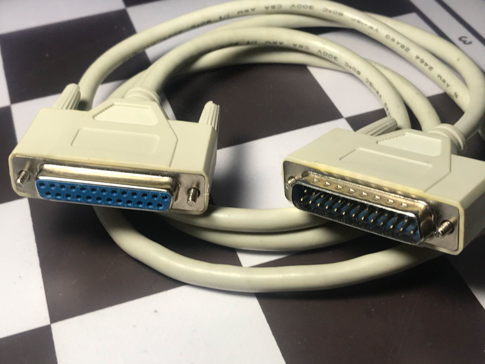

To use the adapter you simply have to plug __ONE keyboard__ to one of the 4 available ports (RJ45, DIN5-240º, DIN5-180º, PS/2) and __the terminal to the right DB-25 connector (female for 5251 and male for 3278)__. The terminal type and connector gender is also clearly marked on the PCB silkscreen. Check that your cable is really straight, pin 1 goes to pin 1, pin 2 goes to pin 2, etc. __It is of the utmost importance not to mix genders or plug the terminal to the wrong connector__, as pretty high voltages are involved on the connectors (+8.5V, +5V. -5V) and the pinouts are incompatible. If you get it wrong you will damage the adapted and/or terminal. __You cannot get it wrong if you stick to only using a male-to-female straight DB25 cable__, as there is no way of plugging it on a wrong configuration.

The adapter will auto-detect the terminal type (5251 or 3278) and use the correct scancode set and signal polarities for the connected terminal.

The buzzer volume can be adjusted using the on-board potentiometer. On the spririt of the original keyboards, the buzzer can be totally silenced only from the terminal (like the clicker on the original keyboards).

The included DIP switches allow to configure a 4-bit keyboard-id for the terminal. The keyboard-id is exclusively used by the terminal and do not modify the adapter operation.

## Layouts

The layouts are designed to replicate the original keyboard functionality. They are not configurable.

### 5251 using a codeset 1 keyboard (XT)

This is the recommended layout for 5251, as it is exactly the same as the original keyboard

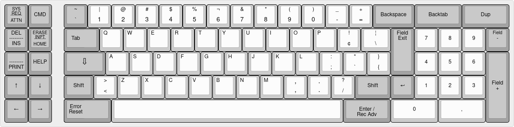

### 5251 using a codeset 2 or 3 keyboard (AT/PS2/Terminal)

Offers the same functionality as the original keyboard, placing keys on similar positions.

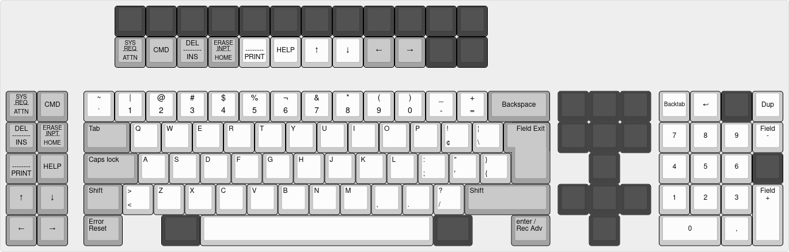

### 3278 using a codeset 2 or 3 keyboard (AT/PS2/Terminal)

This is the recommended layout for 3278, offers extra fuctionality and layout loosely based on 122-key 3270-compatible terminals

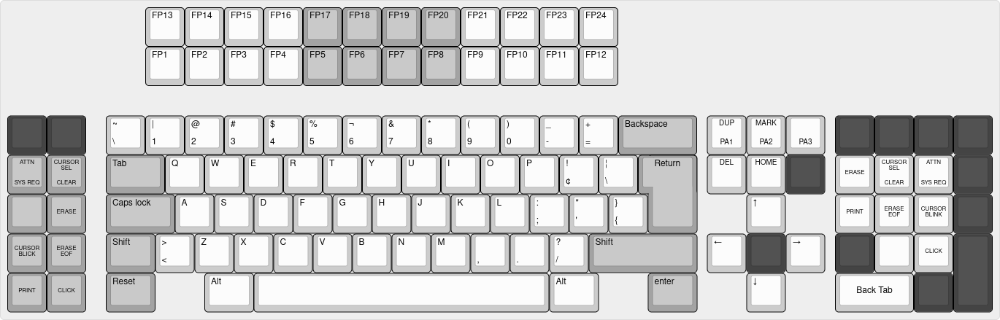

### 3278 using a codeset 1 keyboard (XT)

Do not use it as some keys will be on weird places, offered only for compatibility reasons.

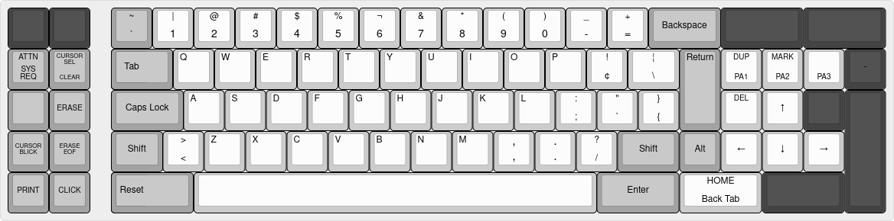

## Kicad files

### Schematics

The design is based on the pro-micro version of TMK adding parallel protocol compatibility.

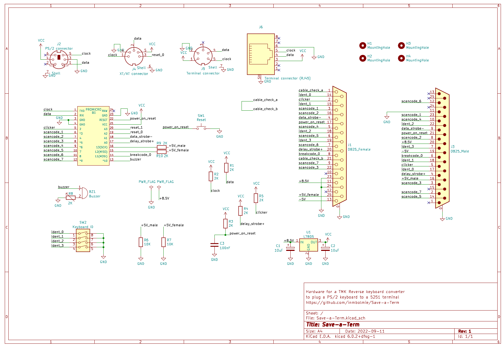

### PCB

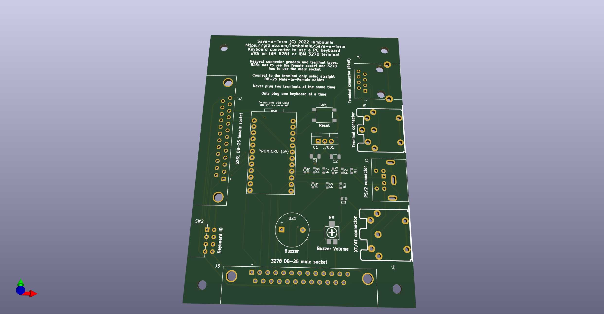

## Case

I provide the STL files for a 3D-printed case (case and lid). The case is assembled using 4 M3x10mm tapered head screws.

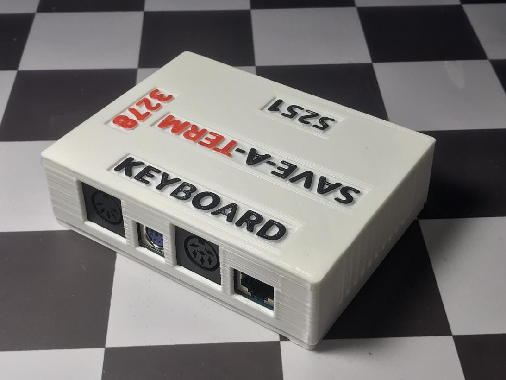

## Fabrication

You can order the PCB's directly from JLCPCB using the provided gerber, bom, and cpl files on the `pcb` directory. You can easily generate files for other fabricators from the Kicad project files.

## Assembly

For the assembly be sure you get the correct gender for DB-25 connectors respecting what is indicated on the silkscreen legends.

You have to use a 5V-16Mhz Arduino pro-micro genuine or compatible microcontroller.

The 7805 regulator can be a regular 7805 or (better) a DC-to-DC pin compatible replacement like a Traco TSR 1-2450E. A 7805 is used to power the board from the 8.5V rail instead of using the +5V rail directly because I found the latter unstable and sometimes providing insufficient voltage to power the controller reliably.

## Programming

You have to use my fork of TMK https://github.com/inmbolmie/ps2_to_4704_converter

`git clone https://github.com/inmbolmie/ps2_to_4704_converter.git`

Go to the `converter/ibmpc_ibm5251` directory and generate the firmware file executing:

`cd ps2_to_4704_converter/converter/ibmpc_ibm5251/`

`make -f Makefile.atmega32u4`

To program the controller, connect it to an USB port on your computer, making sure no terminal is connected to the adapter in case the controller is already soldered on the board. Then push the RESET button on the board and execute on your computer:

`avrdude -p m32U4 -P /dev/ttyACM0 -c avr109 -U flash:w:ibmpc_ibm5251_atmega32u4.hex`

 Where `ibmpc_ibm5251_atmega32u4.hex` is the name of the generated firmware file.

The device name `ttyACM0` could have to be changed to whatever device name your computer assigns to your controller.

__Do not plug the USB port while a terminal is connected to the adapter__

You will need to have the tools needed to build TMK, follow the general instrucions from the TMK code to configure your build environment.

After successful programming you will get output like this:

    Connecting to programmer: .
    Found programmer: Id = "CATERIN"; type = S
        Software Version = 1.0; No Hardware Version given.
    Programmer supports auto addr increment.
    Programmer supports buffered memory access with buffersize=128 bytes.

    Programmer supports the following devices:
        Device code: 0x44

    avrdude: AVR device initialized and ready to accept instructions

    Reading | ################################################## | 100% 0.00s

    avrdude: Device signature = 0x1e9587 (probably m32u4)
    avrdude: NOTE: "flash" memory has been specified, an erase cycle will be performed
             To disable this feature, specify the -D option.
    avrdude: erasing chip
    avrdude: reading input file "ibmpc_ibm5251_atmega32u4.hex"
    avrdude: input file ibmpc_ibm5251_atmega32u4.hex auto detected as Intel Hex
    avrdude: writing flash (27136 bytes):

    Writing | ################################################## | 100% 1.69s

    avrdude: 27136 bytes of flash written
    avrdude: verifying flash memory against ibmpc_ibm5251_atmega32u4.hex:
    avrdude: load data flash data from input file ibmpc_ibm5251_atmega32u4.hex:
    avrdude: input file ibmpc_ibm5251_atmega32u4.hex auto detected as Intel Hex
    avrdude: input file ibmpc_ibm5251_atmega32u4.hex contains 27136 bytes
    avrdude: reading on-chip flash data:

    Reading | ################################################## | 100% 0.17s

    avrdude: verifying ...
    avrdude: 27136 bytes of flash verified

    avrdude: safemode: Fuses OK (E:CB, H:D8, L:FF)

    avrdude done.  Thank you.

Now your controller is ready to be used.
